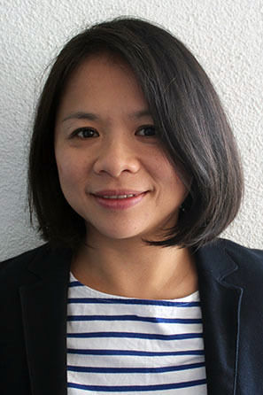
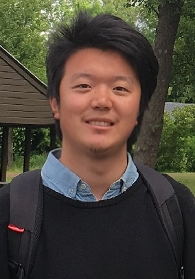
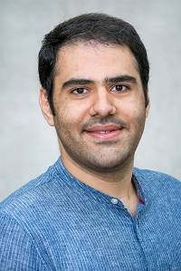
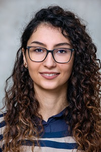

## Lead

<table><tr>
<td>  </td>
<td> Associate Professor Lydia Y. Chen    <a href="https://lydiaychen.com/">Personal Website</a></td>
</tr></table>

## Postdocs

<table><tr>
<td>  </td>
<td> Zilong ZHAO    <a href="https://www.linkedin.com/in/zilong-zhao/">Linkedin</a></td>
</tr></table>

## Ph.D. Students
<table><tr>
<td>  </td>
<td> Masoud Ghiassi    <a href="https://www.tudelft.nl/ewi/over-de-faculteit/afdelingen/software-technology/distributed-systems/people/masoud-ghiassi/">Personal Website</a></td>
</tr></table>

<table><tr>
<td>  </td>
<td> Taraneh Younesian    <a href="https://www.tudelft.nl/ewi/over-de-faculteit/afdelingen/software-technology/distributed-systems/people/taraneh-younesian/">Personal Website</a></td>
</tr></table>

## Master and Bachelor Students

## Former Students and Interns
